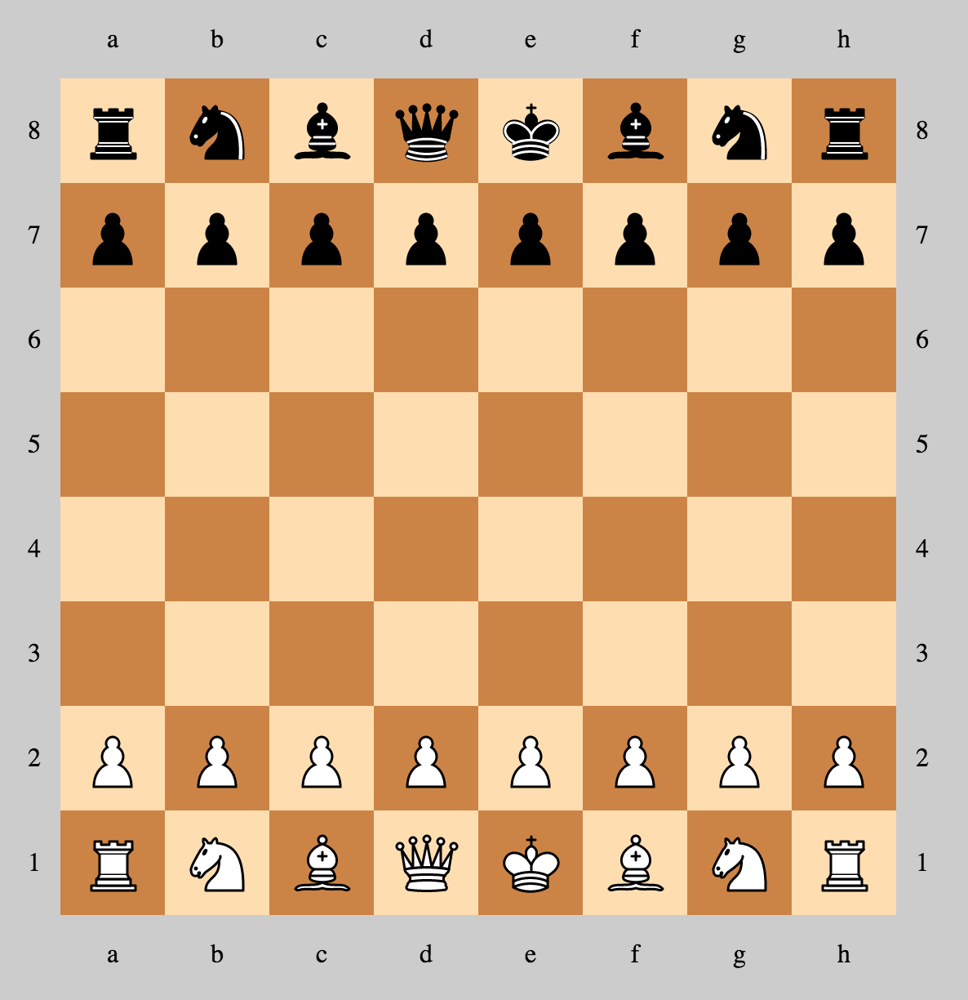

playchess
=========

## What is it?

* playchess is pure javascript chess game client.
* MeteorJS enables realtime(reactive) chess gameplay between opponents.
* It is wrapped with MeteorJS but it can be used with any other framework.
* It can be connected to backend system so there can be brute force, valuation or even ai logic to drive game play.
* WebWorkers can be used instead of backend system for single play.
* Application includes client game play using browser events over dom.

## Motivation

* Chess is my personal interest
* Create a game using MeteorJS

## Installation (Run dev environment)

* git clone https://github.com/erhangundogan/playchess.git

* cd playchess

* meteor

### Issues (Game play)

* Promotion and change piece

* Check-mate

### Author

**Erhan Gundogan**

* http://github.com/erhangundogan
* http://twitter.com/erhangundogan
* http://tr.linkedin.com/in/erhangundogan/

License
=======

Copyright 2015 Erhan Gundogan

Licensed under the [MIT](LICENSE) License.